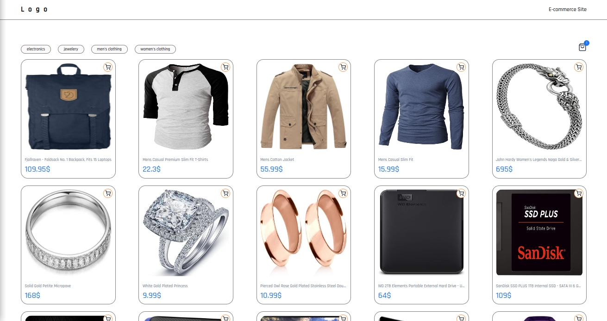

# vue-shopping-app

This demo project is developed using vue 3 and third pary api called fake store api


## Third-party API used

 - [Fake Store API](https://fakestoreapi.com/)


## Project Setup

```sh
npm install
```

### Compile and Hot-Reload for Development

```sh
npm run dev
```

### Compile and Minify for Production

```sh
npm run build
```
## Screenshots




